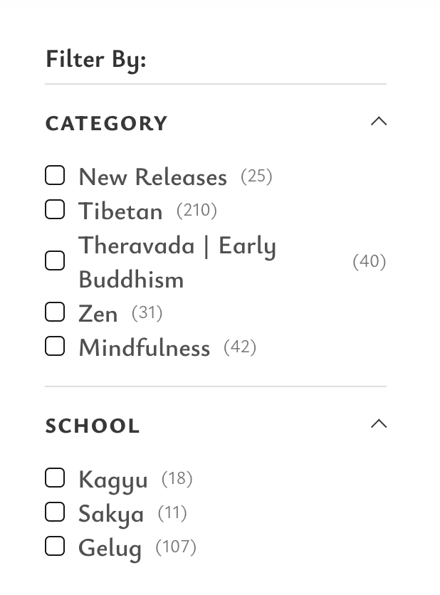

# Spiritual Publisher Filter Navs

Research notes on how major contemplative / Buddhist publishers structure bookstore filtering. Useful reference while designing Dharma Atlas Books filters.

**Last updated:** 2026-07-24  
**Related:** [`ontology.md`](./ontology.md) (site-wide tradition tree), [`books-taxonomy.md`](./books-taxonomy.md)

---

## Pattern overview

| Publisher | Primary pattern | Facets / axes | Lineage depth |
| --- | --- | --- | --- |
| **Wisdom Publications** | Collapsible checkbox sidebar (“Filter By”) | Category, School (+ likely more) | Medium — tradition + Tibetan school |
| **Shambhala Publications** | Topic / tradition hub pages (browse, not faceted sidebar) | Tradition → topic tags; Reader Guides | Deep — nested schools & practices |
| **Sounds True** | Faceted shop filters + mega-nav | Format, Author, Topic | Shallow — lifestyle topics, not lineage |
| **Pariyatti** | Collection / audience navigation | Practice audience, format, language | Narrow — Vipassana / Goenka-centered |

---

## 1. Wisdom Publications

**Site:** [wisdomexperience.org](https://wisdomexperience.org/)  
**Captured UI:** sidebar filter on product listing pages

### Interaction model

- Left sidebar titled **Filter By:**
- Collapsible sections (chevron toggles expand / collapse)
- Each option is a **checkbox** with a **result count** in parentheses
- Multi-select within and across sections
- Horizontal rules separate sections
- Minimal chrome: black text / checkboxes on white

### Facets (visible in screenshot)

#### Category

| Option | Count (at capture) |
| --- | --- |
| New Releases | 25 |
| Tibetan | 210 |
| Theravada \| Early Buddhism | 40 |
| Zen | 31 |
| Mindfulness | 42 |

Notes:

- Mixes **status** (New Releases), **major tradition** (Tibetan / Theravada / Zen), and **practice theme** (Mindfulness) in one facet.
- Theravada is labeled as a compound: `Theravada | Early Buddhism`.

#### School

| Option | Count (at capture) |
| --- | --- |
| Kagyu | 18 |
| Sakya | 11 |
| Gelug | 107 |

Notes:

- School appears to refine **Tibetan** further (classic four-school model; Nyingma may appear below the fold / when scrolling).
- Category and School are separate facets — Category ≈ broad tradition, School ≈ Tibetan lineage.

### Related browse taxonomy (site mega-nav / topics)

Beyond the sidebar, Wisdom also browses by interest clusters such as:

- Academic & translations / series (Library of Tibetan Classics, Teachings of the Buddha, etc.)
- Theravada (jhana, vipassana, Pali Canon, meditation)
- Tibetan (Bön, Gelug, Kagyu / Mahāmudrā, Nyingma / Dzogchen, Sakya, Dalai Lama)
- Zen / Chan / Sŏn (classical Zen, koans)
- Children’s books, mindfulness

### Takeaways for Dharma Atlas

- Clearest “bookstore filter” reference among Buddhist presses.
- Separating **tradition (Category)** from **lineage school** matches how practitioners think.
- Result counts reduce empty-filter anxiety.
- Putting New Releases + Mindfulness beside traditions is pragmatic merchandising, not a pure ontology.

---

## 2. Shambhala Publications

**Site:** [shambhala.com](https://www.shambhala.com/)  
**Primary browse:** topic hubs and tradition landing pages (e.g. [Buddhist Topics](https://www.shambhala.com/buddhist-topics/), [Buddhism categories](https://www.shambhala.com/browse-categories/buddhism.html))

### Interaction model

- Less of a faceted checkbox sidebar; more **curated topic directories** and **Reader Guides**
- Catalog pages support sort (position, price, title, publication date) and page size
- Deep linking into tradition → school → practice topic

### Taxonomy (Buddhism)

#### General Buddhism & Theravada

Examples: Abhidharma, Bodhisattva Path, Insight Meditation, Thai Forest Tradition, Four Noble Truths, Madhyamaka, Yogacara, Engaged Buddhism, Women in Buddhism, Buddhist Psychology, Death & Dying, …

#### Tibetan Buddhism

Examples / nesting:

- Schools: Gelug, Kagyu (Drikung, Drukpa, Karma, Shangpa, Mahamudra, Karmapas), Nyingma (Dzogchen, Longchen Nyingtik, Dudjom Tersar, Terma…), Sakya, Jonang, Kadam, Bon
- Practices / genres: Lam Rim, Lojong, Ngondro, Bardo, Chöd & Zhije, Kalachakra, Tantra, Tonglen, Dream Yoga, Restricted texts, Tibetan Medicine, …

#### Zen, Chan, and Soen

Examples: Chan/Chinese Zen, Japanese Zen, Soto, Rinzai, Soen/Korean, Dogen, Hakuin, Koan practice, Teisho, Zen art, …

### Takeaways for Dharma Atlas

- Best reference for **depth of lineage ontology** (especially Tibetan nesting).
- Browse-by-topic is editorial/curated, not a pure filter UI — good for content hubs, heavier for a filter panel.
- Reader Guides are a strong pattern for “help me enter this tradition.”

---

## 3. Sounds True

**Site:** [soundstrue.com](https://www.soundstrue.com/)  
**Shop listing:** `/collections/all` with facet controls

### Interaction model

- Product listing with filter buttons: **Format**, **Author**, **Topic**
- Separate sort control (Highest Rated, Newest, Price, A–Z, …)
- Mega-nav also organizes Shop by Teacher / Topic / Format
- Author collections are first-class (Tara Brach, Michael Singer, Adyashanti, …)

### Facets (shop + nav)

#### Format

- Online Courses
- In-Depth Programs
- Video
- Audio
- Digital Membership
- Books
- Gift Cards

#### Topic (examples from nav)

- Meditation & Mindfulness
- Spirituality & Awakening
- Relationships
- Subtle Energy
- Self-Compassion
- Yoga & Movement
- Conscious Business
- New and Upcoming Books

#### Author / Teacher

Featured teachers in nav + full author index; filtering is people-first more than lineage-first.

### Takeaways for Dharma Atlas

- Strong **format** facet (books vs audio vs courses) — useful if we expand beyond print.
- Topics are **secular / wellness framed**, not Buddhist school framed.
- Author as a primary filter is worth considering once our catalog is larger.

---

## 4. Pariyatti

**Site:** [store.pariyatti.org](https://store.pariyatti.org/)

### Interaction model

- Collection-based storefront more than multi-facet sidebar
- Home surfaces curated collections (Bestsellers, New, Free, eBooks, Bargain Bin, Amazon Products)
- Deep focus on **Vipassana as taught by S.N. Goenka**, with audience gating (e.g. materials for “old students”)

### Browse axes

- **Audience / practice path:** Vipassana Meditation, introductory vs post-course materials
- **Format:** Books / eBooks, audio/video downloads & streaming
- **Language:** many titles offered in multiple languages
- **Access:** free products called out as a first-class collection

### Takeaways for Dharma Atlas

- When a press is lineage-narrow, filters collapse into **format + language + audience**, not school.
- Free / access-level as a filter can matter for practice orgs.

---

## Cross-publisher themes

1. **Tradition vs school vs topic are different axes.** Wisdom separates Category (tradition/theme) from School; Shambhala nests school under tradition; Sounds True mostly ignores lineage.
2. **Counts next to checkboxes** (Wisdom) are the cleanest multi-select affordance.
3. **Merchandising facets** (New Releases, Bestsellers, Free) sit beside ontological ones almost everywhere.
4. **Author / teacher** becomes more important as catalogs get cross-tradition (Sounds True).
5. **Format** matters once audio/courses enter the mix.

---

## Implications for Dharma Atlas Books

Current DA filters: search, Topic chips, Publisher multi-select.

Promising additions inspired by this survey:

| Idea | Inspired by | Notes |
| --- | --- | --- |
| Tradition / Category checkboxes with counts | Wisdom | Align with our ontology (Tibetan, Zen, Theravada, …) |
| School refine when Tibetan (etc.) selected | Wisdom + Shambhala | Gate school facet on parent tradition |
| Keep Publisher as multi-select dropdown | — | Already matches “many presses, few selected” |
| Optional Author facet later | Sounds True | Once catalog size justifies it |
| New / featured as a soft facet | Wisdom, Pariyatti | Merchandising, not ontology |

---

## Still to capture

- Full Wisdom sidebar below the fold (Format? Author? Series? Price?)
- Snow Lion archive patterns (now under Shambhala / historical)
- Buddhist Publication Society (BPS), Lion’s Roar shop, New World Library
- Desktop vs mobile filter UX differences for Wisdom and Sounds True

Add screenshots under `docs/` as `*-filter-nav.png` when captured.
